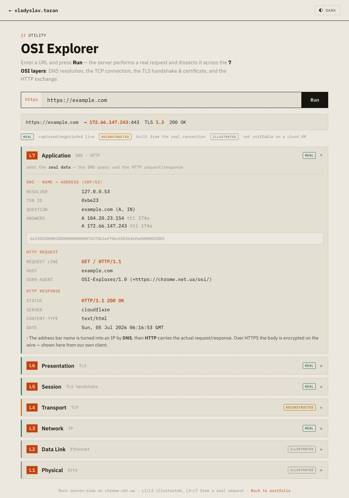

# OSI Explorer

Enter a URL, press **Run**, and see a **real** connection dissected across the
**7 OSI layers** — DNS resolution, the TCP connection, the TLS handshake &
certificate, and the application exchange.

Works for **HTTP(S)**, **FTP(S)**, **SMTP(S)**, **IMAP(S)**, **POP3(S)**,
**SSH**, and **WebSocket** — the same lower layers (L1–L6) with a different
protocol on top, which is exactly the point of the OSI model.

**Live demo:** https://chrome.net.ua/osi/  ·  deep-links auto-run:
`?url=https://example.com` · `?url=ssh://github.com` · `?url=imaps://imap.gmail.com`



## What it shows

For every layer the UI shows *what information is added*, the real values, a
plain-English explanation, and an honesty badge:

| Layer | Shown | Source |
|------|-------|--------|
| **L7 Application** | DNS query + answers/TTL, the **recursive walk** (root → TLD → authoritative); then the protocol exchange — HTTP request/response, the WebSocket **101** upgrade, the SSH version banner, or the **FTP/SMTP/IMAP/POP3** server greeting | 🟢 **real** |
| **L6 Presentation** | TLS version, negotiated cipher, X.509 certificate + **full chain** (leaf → root) | 🟢 **real** |
| **L5 Session** | TLS handshake — SNI, ciphers **offered vs chosen**, and the **real handshake messages** (bytes) captured with `openssl s_client -msg` | 🟢 **real** |
| **L4 Transport** | TCP ports, 3-way handshake | 🟠 facts real, packet bytes **reconstructed** |
| **L3 Network** | source/destination IP, TTL | 🟢 **real** |
| **L2 Data Link** | MAC framing / first hop | ⚪ **illustrated** |
| **L1 Physical** | bits on the medium | ⚪ **illustrated** |

Every layer header links to its **Wikipedia article** ("what's this?"), and key
terminology is clickable — protocols (TLS, TCP, IP, DNS…) to Wikipedia, and
cipher suites (e.g. `TLS_AES_256_GCM_SHA384`) to
[ciphersuite.info](https://ciphersuite.info).

**Honest by design:** a browser can't sniff L1–L4 off the wire, so the backend
performs a real request and reports the layers it genuinely can (L3–L7). Lower
layers are *reconstructed* from the real connection or *illustrated*, and
labeled as such. The secure-vs-plain variants are a built-in teaching contrast —
`http`/`ftp`/`smtp`/… show the L7 exchange in the clear, while
`https`/`ftps`/`smtps`/… add the full TLS handshake at L5/L6 (SSH is a third
case: it brings its *own* transport encryption, not TLS).

## Architecture

```
browser ──POST /osi/api/analyze──► nginx ──► osi.py (Python stdlib, 127.0.0.1:8091)
                                                │
             real UDP DNS query ────────────────┤  L7 DNS
             TCP connect (to validated IP) ──────┤  L4/L3
             TLS handshake via ssl module ───────┤  L6/L5  (cipher, cert)
             L7 exchange by protocol ────────────┘  HTTP req/resp · WS 101
                                                     upgrade · SSH/FTP/SMTP/
                                                     IMAP/POP3 server banner
```

- **Backend:** `server/osi.py` — **stdlib only** (`socket`, `ssl`, `struct`).
- **Frontend:** `web/` — static, renders the 7 layer cards; light/dark theme.

## Security (SSRF)

The URL is user-supplied, so the backend is SSRF-hardened:
- a **curated scheme allow-list** (http/https, ws/wss, ftp/ftps, smtp/smtps,
  imap/imaps, pop3/pop3s, ssh/sftp) mapping to a **fixed port allow-list**
  (`80,443,21,990,22,25,465,587,143,993,110,995`) — no arbitrary ports, so the
  server can't be turned into a general port scanner;
- **read-only** — for the non-HTTP protocols we only read the greeting/banner
  the server sends on connect; no login, no commands are ever sent;
- the hostname is resolved and **every** resulting IP must be public
  (private / loopback / link-local / reserved ranges are rejected — blocks cloud
  metadata `169.254.169.254`, `127.0.0.1`, etc.);
- it connects to the **exact validated IP** (no DNS-rebinding window);
- short timeouts.

## Setup

```bash
sudo mkdir -p /opt/osi && sudo cp server/osi.py /opt/osi/
sudo cp server/osi.service /etc/systemd/system/
sudo systemctl daemon-reload && sudo systemctl enable --now osi
curl -s http://127.0.0.1:8091/api/health         # {"ok": true}
```

Serve `web/` statically and reverse-proxy `/osi/api/` to the backend — see
`nginx.conf.example`.

## API

`POST /osi/api/analyze` → `{"url": "https://example.com"}` → JSON with `dns`,
`tcp`, `tls`, and an `l7` section whose `type` is `http` / `ws` / `banner` /
`ssh` depending on the protocol (or `{"ok": false, "error": "..."}`).

Try it from the shell:
```bash
curl -s -X POST https://chrome.net.ua/osi/api/analyze \
  -H 'Content-Type: application/json' -d '{"url":"https://example.com"}'
```

## License

[MIT](LICENSE) © 2026 Vladyslav Taran
